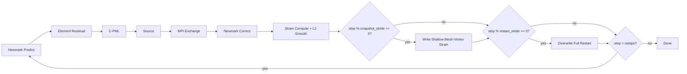

# forward/ — C++ Elastic SEM Forward Solver

## Purpose

Elastic wave propagation solver using Continuous Galerkin Spectral Element Method (CG-SEM).
Reads partition files + config.h5, computes the full volume, writes shallow mesh-vertex strain snapshots and latest-only restart files.

## Architecture

### Library (libgf)

| Header | Implementation | Responsibility |
|--------|----------------|----------------|
| `types.hpp` | — | `SimulationConfig`, `MeshConfig`, `RankData`, `ExchangePattern` structs |
| `gll.hpp` | — | GLL quadrature nodes, weights, derivative matrices (inline, templated) |
| `element.hpp` | `element.cpp` | Element-level K·u matrix-free residual, strain computation |
| `assembly.hpp` | `assembly.cpp` | Global assembly: scatter-add element residuals, L2 strain projection |
| `newmark.hpp` | `newmark.cpp` | Newmark predictor-corrector (β=0, γ=½ explicit) |
| `source.hpp` | `source.cpp` | Source injection via precomputed Lagrange weights |
| `pml.hpp` | `pml.cpp` | C-PML memory variable update + acceleration correction |
| `exchange.hpp` | `exchange.cpp` | MPI halo exchange using precomputed face-pair patterns |
| `io.hpp` | `io.cpp` | HDF5 reader for partition/config files |
| `record.hpp` | `record.cpp` | Extendible shallow mesh-vertex strain snapshot writer |
| `solver.hpp` | `solver.cpp` | `run_forward()` main time integration loop |
| — | `main.cpp` | MPI entry point, CLI parsing (`--direction` flag) |

### Solver Executable (`gf_solver`)

```bash
mpirun -n N gf_solver --direction x     # from CWD with frozen paths
```

All I/O paths are frozen relative to CWD:

- Input: `config.h5`, `partitions/partition_{r}.h5`
- Strain output: `wavefields/{direction}/record_{r}.h5`
- Restart output: `restart/{direction}/restart_{r}.h5`

Directory creation is the caller's responsibility (shell script does `mkdir -p`).

### Time Loop (per step)

```
Newmark predict (ũ, ṽ)
→ element residual (matrix-free K·u)
→ C-PML memory update + acceleration correction
→ source injection (precomputed weights)
→ MPI halo exchange (face-pair patterns)
→ Newmark correct (u, v, a)
→ strain compute (element pass)
→ L2 strain smoothing (global projection)
→ shallow mesh-vertex strain write (if step % snapshot_stride == 0)
→ full-volume restart overwrite (if step % restart_stride == 0)
```

### Runtime Loop Driver



## Config Source

`solver_dt` — Newmark timestep (from config.h5 `/simulation/solver_dt`).
`snapshot_stride` — write strain snapshot when `step % snapshot_stride == 0`.
`restart_stride` — overwrite latest restart when `step % restart_stride == 0`.
`record_depth_actual_m` — bottom of recorded shallow volume, snapped by preprocess to a horizontal spectral-element face.

## Record File Schema

`wavefields/{direction}/record_{r}.h5` attrs: `rank`, `source_direction`, `basis="mesh_vertices"`, `record_depth_max_m`, `record_depth_actual_m`, `excludes_pml`.

Datasets:

- `vertex_ids`: `int64[n_record_vertices]` global mesh vertex IDs (1-based)
- `strain`: `[n_snapshots, n_record_vertices, 6]` (extendible along dim 0)

## Restart File Schema

`restart/{direction}/restart_{r}.h5` is latest-only and overwritten. It stores all state required for exact resume:

- `displacement`, `velocity`, `acceleration`: full local volume at GLL nodes
- all active C-PML memory variables
- attrs: `step`, `time_s`, `source_direction`, `ngll`

## Tests

`tests/test_*.cpp` — Catch2 tests across GLL, element, assembly, Newmark, PML, source, exchange, IO, record, compress, integration.

## Design Doc

`docs/superpowers/design/forward.md`
